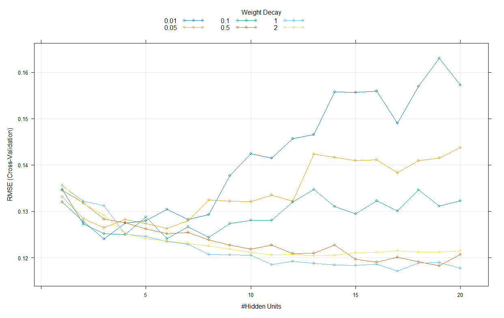
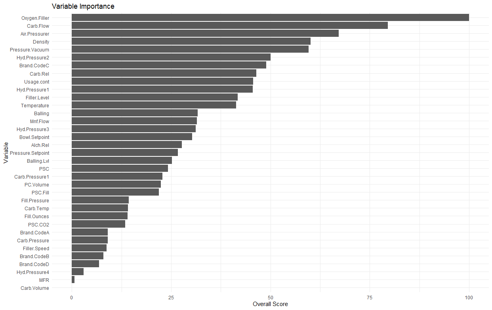
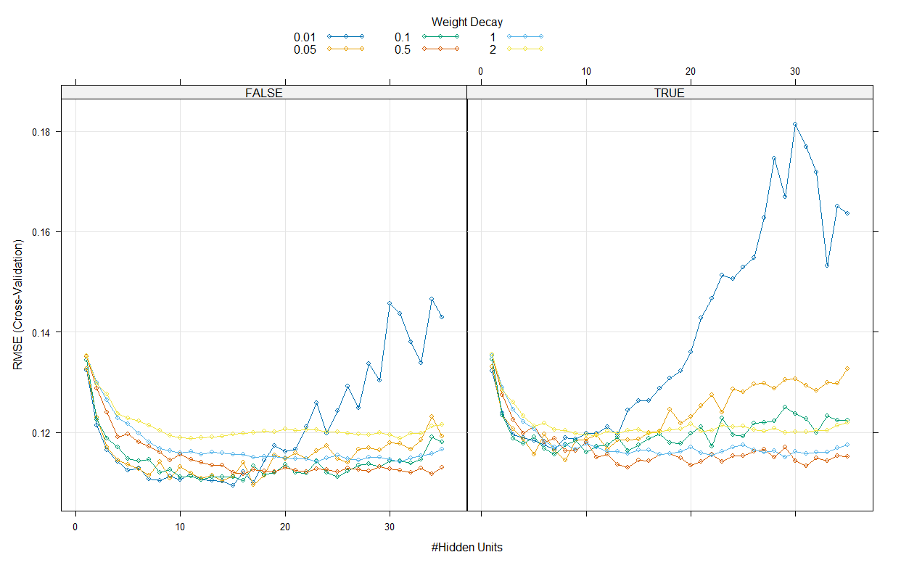
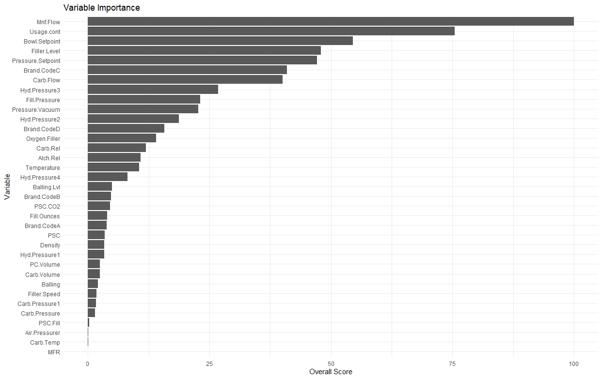

### Load packages  

```{r load-packages, message=FALSE, warning=FALSE}
library(tidyverse)
library(readxl)
library(imputeTS)
library(corrplot)
library(correlation)
library(caret)
library(randomForest)
library(doParallel)
library(xgboost)
```

```{r setup, include = FALSE}
knitr::opts_chunk$set(warning = FALSE, message = FALSE)
```

# Neural Networks

The concept of Neural Networks is a node-layer system trained on an existing dataset. An artificial neural network (ANN) model contains an input layer, hidden layers, and an output layer, with each of these layers containing nodes.  At the input layer, each node contains a dimension of the dataset. At the outer layer, each node represents the final output or prediction.  The hidden layers are the core of the model, where the computation and learning take place.  Each node of a neural network in a hidden layer takes in a set of the input, performs a computation based on the activation function, and then creates an output.  These outputs are assigned weights which determine its level of consideration in the final output and are adjusted throughout the training process.  The model is trained over many cycles, called epochs.  At the end of each batch, a loss function is evaluated based on the model’s performance. Batches are subsets of the training dataset, and in the case of the nnet package in R, batch size is equal to the size of the dataset as a whole.  With supervised learning, the dataset will have various input parameters as well as a known output.  The loss function compares the model output with the known output.  Weights for each node are adjusted based on this loss function, and the model is said to converge when the loss function no longer decreases.  

ANN models can utilize parallel processing, allowing faster model training.  As the weight of each node is adjusted through the process mentioned above, ANN models can distinguish important input parameters; as our dataset contains over 30 input variables, we tested various ANN models as a potential choice for predicting pH.  Since some of the input variables are highly correlated, we can account for this in the ANN model by testing various weight decay values to prevent overfitting.  

The nnet method (nnet) in the nnet package was used with caret to tune an ANN model to the data.  

```{r message=FALSE, warning=FALSE,eval=FALSE}
StudentData <- read.csv("https://raw.githubusercontent.com/MarjeteV/data624/refs/heads/main/imputed_test_data.csv")

# Parallel processing
cores <- detectCores()
cl <- makeCluster(cores)
registerDoParallel(cl)

set.seed(8675309)
trainIndex <- createDataPartition(StudentData$PH, p = 0.75, list = FALSE)
trainData <- StudentData[trainIndex, ]
testData <- StudentData[-trainIndex, ]
# Separate x, y, train
x_train <- trainData[, names(trainData) != "PH"]
y_train <- trainData$PH
x_test <- testData[, names(testData) != "PH"]
y_test <- testData$PH
```

Data was preprocessed with centering and scaling, and a linear activation function was used.  The model utilized cross validation, and 500 maximum iterations were specified in the tuning phase.  Since the nnet package defaults to a batch size equal to the training set size, the number of epochs is equal to the max number of iterations specified given that the model does not converge before the max iterations is reached.  For the tuning grid, we tested 1:35 nodes and weight decay regularization values of 0.01, 0.05, 0.1, 0.5, 1, and 2.  Using these parameters, we found a best tune model with 20 nodes and a 0.5 decay.  This resulted in a test set RMSE of 0.119 and an R2 of 0.518.  

```{r message=FALSE, warning=FALSE,eval=FALSE}
# tuning grid
nnetGrid <- expand.grid(
 size = 1:35,
 decay = c(0.01,0.05, 0.1, 0.5, 1, 2)
 )

# model
nnetTuned <- train(
 x = x_train,
 y = y_train,
 method = "nnet", 
 tuneGrid = nnetGrid,
 preProc = c("center", "scale"),
 trControl = trainControl(method = "cv"),
 linout = TRUE,
 trace = FALSE,
 maxit = 500,
 MaxNWts = 35 * (ncol(x_train) + 1) + 35 + 1)

# Tuning plot
plot(nnetTuned)
# Model results
nnetTuned$bestTune
```

```{r echo=FALSE, out.width = '100%'}

```
<pre>
    size decay
101   17     1
</pre>

```{r message=FALSE, warning=FALSE,eval=FALSE}
# Test set predictions & metrics
nnetPred <- predict(nnetTuned, newdata = x_test)
postResample(pred = nnetPred, obs = y_test)
```

<pre>
      RMSE   Rsquared        MAE
0.11281243 0.55485083 0.08694197
</pre>

Taking a look at the variable importance of this nnet model, we can see that variables of high importance are Density, Mnf Flow, Bowl Setpoint, and Temperature.

```{r message=FALSE, warning=FALSE,eval=FALSE}
# Variable importance
nnetTuned_final_varImportance <- varImp(nnetTuned)

nnetTuned_final_importance_df <- data.frame(Variable= rownames(nnetTuned_final_varImportance$importance),
                                Overall=nnetTuned_final_varImportance$importance$Overall) 

nnetTuned_final_importance_df |> ggplot( aes(y = reorder(Variable, +Overall), x = Overall)) + geom_bar(stat = "identity") + labs(
    title = "Variable Importance",
    x = "Overall Score",
    y = "Variable"
  )  + theme_minimal()
```

```{r echo=FALSE,  out.width = '100%'}

```
In addition to exploring various regularization values, an ensemble neural network method, average neural net (avnnet), was also tuned to account for the highly correlated variables.  For the tuning grid, we again tested 1:35 nodes and weight decay regularization values of 0.01, 0.05, 0.1, 0.5, 1, and 2.  We also specified both bootstrapped aggregation and no bootstrapped aggregation in the tuning grid.  The best tuned model had 15 nodes and 0.01 decay, with no bootstrapped aggregation.  

```{r message=FALSE, warning=FALSE,eval=FALSE}
# tuning grid
avNNetGrid <- expand.grid(
 size = 1:35,
 decay = c(0.01,0.05, 0.1, 0.5, 1, 2),
 bag = c(TRUE,FALSE))

# model
avNNetTuned <- train(
 x = x_train,
 y = y_train,
 method = "avNNet", 
 tuneGrid = avNNetGrid,
 preProc = c("center", "scale"),
 trControl = trainControl(method = "cv", allowParallel = TRUE),
 linout = TRUE,
 trace = FALSE,
 maxit = 500,
 MaxNWts = 35 * (ncol(x_train) + 1) + 35 + 1)
# Model results
avNNetTuned$bestTune
# Tuning plot
plot(avNNetTuned)
```

```{r echo=FALSE, out.width = '100%'}

```
<pre>
    size decay   bag
169   15  0.01 FALSE
</pre>

```{r message=FALSE, warning=FALSE,eval=FALSE}
# Test set predictions & metrics
avNNetPred <- predict(avNNetTuned, newdata = x_test)
postResample(pred = avNNetPred, obs = y_test)
```
<pre>
     RMSE  Rsquared       MAE 
0.1143450 0.5677752 0.0824541 
</pre>

However, after a best tune was determined, these best tuned parameters were used for a final model training that included a higher and higher numbers of maximum iterations until RMSE and R2 stabilized.  This final model used a maximum iteration of 5000 and had an RMSE of 0.109 and R2 of 0.603.  

```{r message=FALSE, warning=FALSE,eval=FALSE}
avNNetGrid_final <- expand.grid(
 size = 15,
 decay = 0.01,
 bag = FALSE)

avNNetTuned_final <- train(
 x = x_train,
 y = y_train,
 method = "avNNet", 
 tuneGrid = avNNetGrid_final,
 preProc = c("center", "scale"),
 trControl = trainControl(method = "cv", allowParallel = TRUE),
 linout = TRUE,
 trace = FALSE,
 maxit = 10000,
 MaxNWts = 15 * (ncol(x_train) + 1) + 15 + 1)

avNNetPred_final <- predict(avNNetTuned_final, newdata = x_test)
postResample(pred = avNNetPred_final, obs = y_test)
```
<pre>
      RMSE   Rsquared        MAE 
0.10904335 0.60255419 0.07838364 
</pre>

When examining the variable importance, we can see that Mnf flow ranks as the highest importance variable by a large margin, followed by Usage cont and Bowl Setpoint.  

```{r message=FALSE, warning=FALSE,eval=FALSE}
# Variable importance
avvNNetTuned_final_varImportance <- varImp(avNNetTuned_final)

avvNNetTuned_final_importance_df <- data.frame(Variable= rownames(avvNNetTuned_final_varImportance$importance),
                                Overall=avvNNetTuned_final_varImportance$importance$Overall) 

avvNNetTuned_final_importance_df %>% ggplot( aes(y = reorder(Variable, +Overall), x = Overall)) + geom_bar(stat = "identity") + labs(
    title = "Variable Importance",
    x = "Overall Score",
    y = "Variable"
  )  + theme_minimal()
```
```{r echo=FALSE, out.width = '100%'}

```